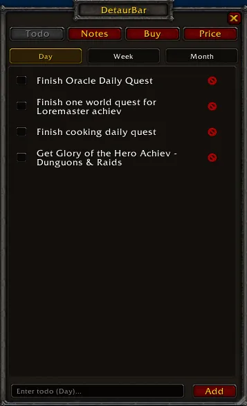
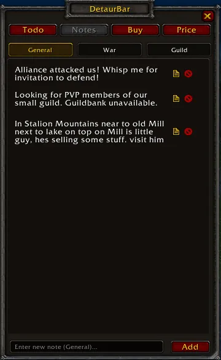
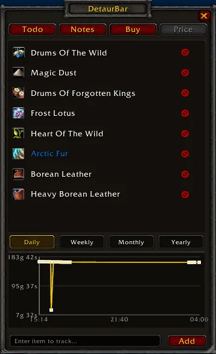

# DetaurBar

In-game organizer addon for **World of Warcraft: Wrath of the Lich King (Patch 3.3.5a)** — designed for Warmane (Icecrown).

## Features

### Todo

- Checklist split into **Day / Week / Month** sub-tabs
- Day resets automatically at 3:00 AM
- Week and Month persist indefinitely

### Notes

- Quick text notes across **General / War / Guild** sub-tabs
- Click any note to paste its text into chat
- Drag notes between sub-tabs to reorganize

### Loot

- Item tracking with icons, rarity colors, and tooltips
- Drag & drop items from bags, AH, or profession windows
- One-click copy to Price list

### Price

- **Two sub-tabs: Low price / All**
- **Low price** — Auto-populated list of items that dropped below your set threshold
  - Shows item icon, name, and current price in gold
  - No graph, no time filters — clean alert list
  - Remove (X) clears threshold and removes from Low price
- **All** — Full item tracking with threshold management
  - Click any item to expand its price history graph
  - **Threshold row** above time filters: shows selected item + gold input + OK (✓) / Clear (X) icons
  - Set target price in gold; when AH scan finds price ≤ threshold, item auto-moves to Low price
  - Items with thresholds show `[Xg]` next to name in the list
  - Graph with **Daily / Weekly / Monthly / Yearly** views
  - Automatic AH scan every 10 minutes when AH is opened
  - Filters by exact item ID — no false matches

### Settings
- **Dungeon** — Screen flash on LFG proposal (enable, color, duration)
- **Wintergrasp** — Registration and battle start warnings with configurable flash + sound
- **Auction** — AH auto-scan interval
- **Random** — Multiple named timer alerts with per-alert interval, flash color, duration, and sound

### General
- Shift-click item linking from bags, profession windows, Auction House
- Drag & drop items directly onto the addon window
- 21,000+ item offline database (Warmane-correct IDs)
- Draggable minimap button
- Resizable and movable window with saved position

## Commands
- `/todo` or `/detaurbar` — Toggle main window
- `/detaurdebug` — Debug info (UI state, DB, minimap button)

## Installation
1. Download and extract the `Detaurtodo` folder
2. Place it in `World of Warcraft\Interface\AddOns\`
3. Launch the game and enable **Detaurtodo** in the AddOns list
4. Type `/todo` or `/detaurbar` to open

## Requirements
- WoW client patch **3.3.5a** (Build 12340)
- Tested on Warmane Icecrown